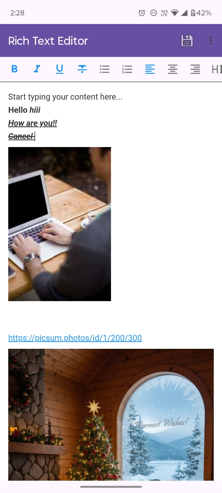
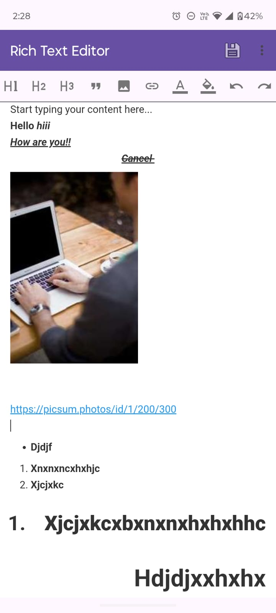
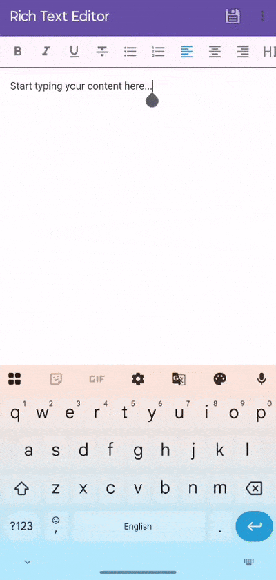

# RichEditor Library

[](https://kotlinlang.org/)
[](LICENSE)
[](#)
[](#)

**A powerful and customizable rich text editor for Android** with comprehensive formatting options, media insertion, and smooth keyboard integration.

Supports 28+ formatting actions including text styling, lists, headings, media embeds, and more—all with beautiful Material Design icons.

---

## Preview

| Media Insertion | Text Styling |
|-----------------|--------------|
|  |  |

### Demo Video
<div align="center">
  
</div>

---

## ✨ Features

- **28+ Formatting Actions** – Complete rich text editing suite
- **Text Styling** – Bold, Italic, Underline, Strikethrough, Subscript, Superscript
- **Text Alignment** – Left, Center, Right justification
- **Headings** – H1 through H6 with unique icons
- **Lists** – Bullet and numbered lists with proper indentation
- **Media Support** – Images, videos, audio, and YouTube embeds
- **Links & Checkboxes** – Hyperlinks with custom text and task lists
- **Colors** – Text and background color customization
- **Font Sizes** – 7 size options for text scaling
- **Undo/Redo** – Full history management
- **Smooth Keyboard** – Proper focus handling and input management
- **Material Icons** – Beautiful vector drawables for all actions
- **Active State Indicators** – Visual feedback for applied formats
- **Highly Customizable** – Add, remove, or reorder toolbar actions
- **WebView-Based** – Reliable HTML/CSS rendering
- **Production Ready** – Memory efficient with proper lifecycle management

---

## Installation

**Step 1:** Add JitPack repository to your `settings.gradle.kts`:

```kotlin
dependencyResolutionManagement {
    repositoriesMode.set(RepositoriesMode.FAIL_ON_PROJECT_REPOS)
    repositories {
        google()
        mavenCentral()
        maven { url = uri("https://jitpack.io") }
    }
}
```

**Step 2:** Add the dependency to your app's `build.gradle.kts`:

```kotlin
dependencies {
	        implementation("com.github.Excelsior-Technologies-Community:RichEditor:1.0.1")
}
```

---

## 🚀 Quick Start

### 1. Add RichEditor to Your Layout

```xml
<LinearLayout
    android:layout_width="match_parent"
    android:layout_height="match_parent"
    android:orientation="vertical">

    <com.ext.rich_editor.RichEditorToolbar
        android:id="@+id/richEditorToolbar"
        android:layout_width="match_parent"
        android:layout_height="wrap_content"
        android:background="?attr/colorSurface"
        android:elevation="2dp" />

    <com.ext.rich_editor.RichEditor
        android:id="@+id/richEditor"
        android:layout_width="match_parent"
        android:layout_height="0dp"
        android:layout_weight="1" />

</LinearLayout>
```

### 2. Setup in Activity/Fragment

```kotlin
class MainActivity : AppCompatActivity() {
    
    private lateinit var editor: RichEditor
    private lateinit var toolbar: RichEditorToolbar
    
    override fun onCreate(savedInstanceState: Bundle?) {
        super.onCreate(savedInstanceState)
        setContentView(R.layout.activity_main)
        
        editor = findViewById(R.id.richEditor)
        toolbar = findViewById(R.id.richEditorToolbar)
        
        // Connect toolbar with editor
        toolbar.setEditor(editor)
        
        // Set initial content
        editor.setHtml("<p>Start typing...</p>")
        
        // Focus editor
        editor.postDelayed({
            editor.focusEditor()
        }, 500)
        
        // Setup media insertion
        setupMediaHandlers()
        
        // Listen to changes
        editor.setOnTextChangeListener(object : RichEditor.OnTextChangeListener {
            override fun onTextChange(html: String) {
                // Handle content changes
                saveContent(html)
            }
        })
    }
    
    private fun setupMediaHandlers() {
        toolbar.onInsertImageClick = {
            // Show image picker or URL dialog
            insertImage()
        }
        
        toolbar.onInsertLinkClick = {
            // Show link dialog
            insertLink()
        }
        
        toolbar.onTextColorClick = {
            // Show color picker
            showColorPicker()
        }
    }
    
    override fun onDestroy() {
        super.onDestroy()
        editor.release()
    }
}
```

### 3. Handle Media Insertion

```kotlin
private val imagePickerLauncher = registerForActivityResult(
    ActivityResultContracts.GetContent()
) { uri: Uri? ->
    uri?.let { 
        editor.insertImage(it.toString())
        editor.focusEditor()
    }
}

private fun insertImage() {
    AlertDialog.Builder(this)
        .setTitle("Insert Image")
        .setItems(arrayOf("From Gallery", "From URL")) { _, which ->
            when (which) {
                0 -> imagePickerLauncher.launch("image/*")
                1 -> showUrlDialog { url -> editor.insertImage(url) }
            }
        }
        .show()
}
```

---

## ⚙️ Customization

### Toolbar Appearance - XML Attributes

The `RichEditorToolbar` supports extensive customization through XML attributes or programmatic configuration:

#### 📋 Available Attributes

| Attribute | Type | Description | Default Value |
|-----------|------|-------------|---------------|
| `app:iconSize` | dimension | Size of the icon within each button | `24dp` |
| `app:buttonSize` | dimension | Overall button width and height | `40dp` |
| `app:buttonPadding` | dimension | Internal padding inside each button | `8dp` |
| `app:buttonSpacing` | dimension | Horizontal spacing between buttons | `4dp` |
| `app:activeColor` | color | Icon color when formatting is active | `#2196F3` (Blue) |
| `app:inactiveColor` | color | Icon color in default/inactive state | `#757575` (Gray) |
| `app:toolbarBackgroundColor` | color | Background color of the entire toolbar | `Transparent` |
| `app:toolbarPaddingHorizontal` | dimension | Left and right padding of toolbar | `8dp` |
| `app:toolbarPaddingVertical` | dimension | Top and bottom padding of toolbar | `4dp` |
| `app:enableRipple` | boolean | Enable/disable Material ripple effect | `true` |
| `app:buttonCornerRadius` | dimension | Corner radius for button backgrounds | `4dp` |

#### Example: Customized Toolbar in XML

```xml
<com.ext.rich_editor.RichEditorToolbar
    android:id="@+id/richEditorToolbar"
    android:layout_width="match_parent"
    android:layout_height="wrap_content"
    android:elevation="2dp"
    app:iconSize="22dp"
    app:buttonSize="44dp"
    app:buttonPadding="10dp"
    app:buttonSpacing="6dp"
    app:activeColor="#FF6B35"
    app:inactiveColor="#666666"
    app:toolbarBackgroundColor="#F5F5F5"
    app:toolbarPaddingHorizontal="12dp"
    app:toolbarPaddingVertical="8dp"
    app:enableRipple="true"
    app:buttonCornerRadius="8dp" />
```

#### Example: Programmatic Customization

```kotlin
// Customize toolbar appearance programmatically
toolbar.apply {
    // Icon and button sizes
    iconSize = dpToPx(22)        // Icon size within button
    buttonSize = dpToPx(44)      // Overall button size
    buttonPadding = dpToPx(10)   // Padding inside button
    buttonSpacing = dpToPx(6)    // Space between buttons
    
    // Colors
    activeColor = Color.parseColor("#FF6B35")      // Orange active color
    inactiveColor = Color.parseColor("#666666")    // Gray inactive color
    toolbarBackgroundColor = Color.parseColor("#F5F5F5")  // Light gray background
    
    // Toolbar padding
    toolbarPaddingHorizontal = dpToPx(12)
    toolbarPaddingVertical = dpToPx(8)
    
    // Ripple effect and corner radius
    enableRipple = true
    buttonCornerRadius = dpToPx(8)
}

// Helper function to convert dp to pixels
private fun dpToPx(dp: Int): Int {
    return (dp * resources.displayMetrics.density).toInt()
}
```

### Custom Toolbar Actions

```kotlin
// Clear default actions
toolbar.clearActions()

// Add specific actions
toolbar.addActions(listOf(
    RichEditorToolbar.EditorAction.BOLD,
    RichEditorToolbar.EditorAction.ITALIC,
    RichEditorToolbar.EditorAction.UNDERLINE,
    RichEditorToolbar.EditorAction.UNORDERED_LIST,
    RichEditorToolbar.EditorAction.ORDERED_LIST,
    RichEditorToolbar.EditorAction.INSERT_IMAGE,
    RichEditorToolbar.EditorAction.INSERT_LINK,
    RichEditorToolbar.EditorAction.TEXT_COLOR,
    RichEditorToolbar.EditorAction.UNDO,
    RichEditorToolbar.EditorAction.REDO
))

// Add at specific position
toolbar.addAction(RichEditorToolbar.EditorAction.STRIKETHROUGH, position = 3)

// Remove an action
toolbar.removeAction(RichEditorToolbar.EditorAction.SUPERSCRIPT)
```

### Custom Action Handlers

```kotlin
toolbar.onInsertImageClick = {
    // Your custom image picker
    showCustomImagePicker()
}

toolbar.onInsertVideoClick = {
    // Your custom video picker
    showCustomVideoPicker()
}

toolbar.onInsertYoutubeClick = {
    // Your custom YouTube dialog
    showYoutubeDialog()
}

toolbar.onTextColorClick = {
    // Your custom color picker
    showAdvancedColorPicker()
}

toolbar.onFontSizeClick = {
    // Your custom font size selector
    showFontSizeDialog()
}
```

### Get/Set Content

```kotlin
// Set HTML content
editor.setHtml("<h1>Title</h1><p>Content here</p>")

// Get HTML content
editor.getHtml { html ->
    println("HTML: $html")
    saveToDatabase(html)
}

// Get plain text
editor.getText { text ->
    println("Plain text: $text")
    updateCharacterCount(text.length)
}
```

---

## 🎨 Available Actions

### Text Formatting
| Action | Description | Icon |
|--------|-------------|------|
| `BOLD` | Make text bold | **B** |
| `ITALIC` | Italicize text | *I* |
| `UNDERLINE` | Underline text | <u>U</u> |
| `STRIKETHROUGH` | Strike through text | ~~S~~ |
| `SUBSCRIPT` | Subscript text | X₂ |
| `SUPERSCRIPT` | Superscript text | X² |

### Alignment
| Action | Description |
|--------|-------------|
| `JUSTIFY_LEFT` | Align text left |
| `JUSTIFY_CENTER` | Center align text |
| `JUSTIFY_RIGHT` | Align text right |

### Headings
| Action | Description |
|--------|-------------|
| `H1` | Heading 1 (largest) |
| `H2` | Heading 2 |
| `H3` | Heading 3 |
| `H4` | Heading 4 |
| `H5` | Heading 5 |
| `H6` | Heading 6 (smallest) |
| `BLOCKQUOTE` | Blockquote style |

### Lists & Structure
| Action | Description |
|--------|-------------|
| `UNORDERED_LIST` | Bullet list |
| `ORDERED_LIST` | Numbered list |
| `INDENT` | Increase indent |
| `OUTDENT` | Decrease indent |
| `CHECKBOX` | Insert checkbox |

### Media
| Action | Description |
|--------|-------------|
| `INSERT_IMAGE` | Insert image from gallery/URL |
| `INSERT_VIDEO` | Insert video from gallery/URL |
| `INSERT_AUDIO` | Insert audio from gallery/URL |
| `INSERT_YOUTUBE` | Embed YouTube video |
| `INSERT_LINK` | Insert hyperlink |

### Styling
| Action | Description |
|--------|-------------|
| `TEXT_COLOR` | Change text color |
| `BG_COLOR` | Change background color |
| `FONT_SIZE` | Change font size (1-7) |

### History
| Action | Description |
|--------|-------------|
| `UNDO` | Undo last action |
| `REDO` | Redo last undone action |

---

## 📋 API Reference

### RichEditor Methods

| Method | Description |
|--------|-------------|
| `setHtml(html: String)` | Set HTML content |
| `getHtml(callback: (String) -> Unit)` | Get HTML content |
| `getText(callback: (String) -> Unit)` | Get plain text |
| `focusEditor()` | Focus editor and show keyboard |
| `setBold()` | Apply bold formatting |
| `setItalic()` | Apply italic formatting |
| `setUnderline()` | Apply underline |
| `setStrikethrough()` | Apply strikethrough |
| `setSubscript()` | Apply subscript |
| `setSuperscript()` | Apply superscript |
| `setJustifyLeft()` | Align left |
| `setJustifyCenter()` | Center align |
| `setJustifyRight()` | Align right |
| `setHeading(level: Int)` | Set heading (1-6) |
| `setBlockquote()` | Apply blockquote |
| `insertUnorderedList()` | Insert bullet list |
| `insertOrderedList()` | Insert numbered list |
| `indent()` | Increase indent |
| `outdent()` | Decrease indent |
| `insertImage(url: String)` | Insert image |
| `insertVideo(url: String)` | Insert video |
| `insertAudio(url: String)` | Insert audio |
| `insertYoutube(videoId: String)` | Insert YouTube embed |
| `insertLink(url: String, text: String)` | Insert hyperlink |
| `insertCheckbox(text: String)` | Insert checkbox |
| `setTextColor(color: String)` | Set text color (hex) |
| `setTextBackgroundColor(color: String)` | Set background color |
| `setFontSize(size: Int)` | Set font size (1-7) |
| `undo()` | Undo last action |
| `redo()` | Redo last action |
| `setOnTextChangeListener(listener)` | Listen to content changes |
| `setOnSelectionChangeListener(listener)` | Listen to selection changes |

### RichEditorToolbar Methods

| Method | Description |
|--------|-------------|
| `setEditor(editor: RichEditor)` | Connect with editor |
| `addAction(action: EditorAction, position: Int)` | Add toolbar action |
| `addActions(actions: List<EditorAction>)` | Add multiple actions |
| `removeAction(action: EditorAction)` | Remove action |
| `clearActions()` | Remove all actions |

---

## 🎯 Usage Examples

### Save and Load Content

```kotlin
// Save content
fun saveContent() {
    editor.getHtml { html ->
        // Save to SharedPreferences
        getSharedPreferences("editor", MODE_PRIVATE)
            .edit()
            .putString("content", html)
            .apply()
        
        Toast.makeText(this, "Content saved!", Toast.LENGTH_SHORT).show()
    }
}

// Load content
fun loadContent() {
    val html = getSharedPreferences("editor", MODE_PRIVATE)
        .getString("content", "")
    
    if (!html.isNullOrEmpty()) {
        editor.setHtml(html)
    }
}
```

### Insert Link Dialog

```kotlin
private fun showLinkDialog() {
    val layout = LinearLayout(this).apply {
        orientation = LinearLayout.VERTICAL
        setPadding(50, 40, 50, 10)
    }
    
    val urlInput = EditText(this).apply {
        hint = "URL (required)"
    }
    
    val textInput = EditText(this).apply {
        hint = "Link Text (optional)"
    }
    
    layout.addView(urlInput)
    layout.addView(textInput)
    
    AlertDialog.Builder(this)
        .setTitle("Insert Link")
        .setView(layout)
        .setPositiveButton("Insert") { _, _ ->
            val url = urlInput.text.toString()
            val text = textInput.text.toString().ifEmpty { url }
            if (url.isNotEmpty()) {
                editor.insertLink(url, text)
                editor.focusEditor()
            }
        }
        .setNegativeButton("Cancel") { _, _ ->
            editor.focusEditor()
        }
        .show()
}
```

### Color Picker Dialog

```kotlin
private fun showColorPicker(isTextColor: Boolean) {
    val colors = arrayOf(
        "#000000" to "Black",
        "#FF0000" to "Red",
        "#00FF00" to "Green",
        "#0000FF" to "Blue",
        "#FFFF00" to "Yellow",
        "#FF00FF" to "Magenta",
        "#00FFFF" to "Cyan",
        "#FFA500" to "Orange",
        "#800080" to "Purple"
    )
    
    AlertDialog.Builder(this)
        .setTitle(if (isTextColor) "Text Color" else "Background Color")
        .setItems(colors.map { it.second }.toTypedArray()) { _, which ->
            val color = colors[which].first
            if (isTextColor) {
                editor.setTextColor(color)
            } else {
                editor.setTextBackgroundColor(color)
            }
            editor.focusEditor()
        }
        .show()
}
```

### YouTube Video Insertion

```kotlin
private fun showYoutubeDialog() {
    val input = EditText(this).apply {
        hint = "Enter YouTube Video ID or URL"
        setPadding(50, 40, 50, 40)
    }
    
    AlertDialog.Builder(this)
        .setTitle("Insert YouTube Video")
        .setView(input)
        .setPositiveButton("Insert") { _, _ ->
            val text = input.text.toString()
            val videoId = extractYoutubeId(text)
            if (videoId.isNotEmpty()) {
                editor.insertYoutube(videoId)
                editor.focusEditor()
            }
        }
        .setNegativeButton("Cancel") { _, _ ->
            editor.focusEditor()
        }
        .show()
}

private fun extractYoutubeId(input: String): String {
    return when {
        input.contains("youtube.com/watch?v=") -> 
            input.substringAfter("v=").substringBefore("&")
        input.contains("youtu.be/") -> 
            input.substringAfter("youtu.be/").substringBefore("?")
        input.length == 11 -> input
        else -> ""
    }
}
```

### Listen to Selection Changes

```kotlin
editor.setOnSelectionChangeListener(object : RichEditor.OnSelectionChangeListener {
    override fun onSelectionChange(formats: List<String>) {
        // Update custom UI based on active formats
        updateFormatButtons(formats)
        
        // Example: Show format status
        val activeFormats = formats.joinToString(", ")
        statusTextView.text = "Active: $activeFormats"
    }
})
```

---

## 🔧 Requirements

- **Min SDK:** 21 (Android 5.0 Lollipop)
- **Target SDK:** 34 (Android 14)
- **Kotlin:** 1.8+
- **AndroidX:** Required

### Permissions

Add to `AndroidManifest.xml`:

```xml
<uses-permission android:name="android.permission.INTERNET" />
<uses-permission android:name="android.permission.READ_MEDIA_IMAGES" />
<uses-permission android:name="android.permission.READ_MEDIA_VIDEO" />
<uses-permission android:name="android.permission.READ_MEDIA_AUDIO" />
```

For Android 12 and below, also add:

```xml
<uses-permission 
    android:name="android.permission.READ_EXTERNAL_STORAGE" 
    android:maxSdkVersion="32" />
```

### Activity Configuration

For proper keyboard handling:

```xml
<activity
    android:name=".MainActivity"
    android:windowSoftInputMode="adjustResize">
</activity>
```

---

## 🐛 Troubleshooting

### Keyboard not opening

**Solution:**
1. Ensure `windowSoftInputMode="adjustResize"` in manifest
2. Call `editor.focusEditor()` with a delay:
```kotlin
editor.postDelayed({ editor.focusEditor() }, 500)
```

### Icons not showing

**Solution:**
1. Verify all 28 XML files are in `rich-editor/src/main/res/drawable/`
2. Sync Gradle: File → Sync Project with Gradle Files
3. Clean and Rebuild: Build → Clean Project → Rebuild Project

### WebView not loading

**Solution:**
1. Check internet permission in manifest
2. Enable hardware acceleration:
```xml
<application android:hardwareAccelerated="true">
```

### Content not saving

**Solution:**
Use callback pattern:
```kotlin
editor.getHtml { html ->
    // Save here, not before callback
    saveToDatabase(html)
}
```

### Focus lost after toolbar action

**Solution:**
Always call `editor.focusEditor()` after actions:
```kotlin
toolbar.onInsertImageClick = {
    insertImage()
    editor.focusEditor() // Add this
}
```

---

## 📦 Vector Icons Included

The library includes 28 professionally designed Material icons:

- ✅ **Text Formatting:** Bold, Italic, Underline, Strikethrough, Subscript, Superscript
- ✅ **Alignment:** Left, Center, Right
- ✅ **Headings:** H1, H2, H3, H4, H5, H6, Blockquote
- ✅ **Lists:** Bullets, Numbers, Indent, Outdent
- ✅ **Media:** Image, Video, Audio, YouTube, Link, Checkbox
- ✅ **Styling:** Text Color, Background Color, Font Size
- ✅ **History:** Undo, Redo

All icons are:
- 24dp × 24dp
- Properly oriented (no mirrored numbers)
- Active state: Blue (#2196F3)
- Inactive state: Gray (#757575)

---

## 🎓 Advanced Usage

### Custom Editor Styling

Modify the HTML/CSS in `RichEditor.kt`:

```kotlin
private fun loadEditorHtml() {
    val html = """
    <style>
        body { 
            font-family: 'Your Custom Font';
            font-size: 18px;
            background-color: #f5f5f5;
            color: #333;
        }
        blockquote {
            border-left: 4px solid #YOUR_COLOR;
        }
    </style>
    """
    // ... rest of HTML
}
```

### Programmatic Formatting

```kotlin
// Apply multiple formats
fun formatSelectedText() {
    editor.setBold()
    editor.setTextColor("#FF0000")
    editor.setFontSize(5)
}

// Insert complex content
fun insertSignature() {
    val signature = """
        <div style="margin-top: 20px;">
            <p><strong>Best regards,</strong></p>
            <p>John Doe</p>
            <p><a href="mailto:john@example.com">john@example.com</a></p>
        </div>
    """
    editor.getHtml { currentHtml ->
        editor.setHtml(currentHtml + signature)
    }
}
```

### Export to PDF

```kotlin
fun exportToPdf() {
    editor.getHtml { html ->
        // Use a library like iText or Android's PrintHelper
        val document = """
            <html>
                <head><style>body { font-family: sans-serif; }</style></head>
                <body>$html</body>
            </html>
        """
        // Convert to PDF
        createPdfFromHtml(document)
    }
}
```

## 📄 License

```
MIT License

Copyright (c) 2025 Excelsior Technologies

Permission is hereby granted, free of charge, to any person obtaining a copy
of this software and associated documentation files (the "Software"), to deal
in the Software without restriction, including without limitation the rights
to use, copy, modify, merge, publish, distribute, sublicense, and/or sell
copies of the Software, and to permit persons to whom the Software is
furnished to do so, subject to the following conditions:

The above copyright notice and this permission notice shall be included in all
copies or substantial portions of the Software.

THE SOFTWARE IS PROVIDED "AS IS", WITHOUT WARRANTY OF ANY KIND, EXPRESS OR
IMPLIED, INCLUDING BUT NOT LIMITED TO THE WARRANTIES OF MERCHANTABILITY,
FITNESS FOR A PARTICULAR PURPOSE AND NONINFRINGEMENT. IN NO EVENT SHALL THE
AUTHORS OR COPYRIGHT HOLDERS BE LIABLE FOR ANY CLAIM, DAMAGES OR OTHER
LIABILITY, WHETHER IN AN ACTION OF CONTRACT, TORT OR OTHERWISE, ARISING FROM,
OUT OF OR IN CONNECTION WITH THE SOFTWARE OR THE USE OR OTHER DEALINGS IN THE
SOFTWARE.
```

---


